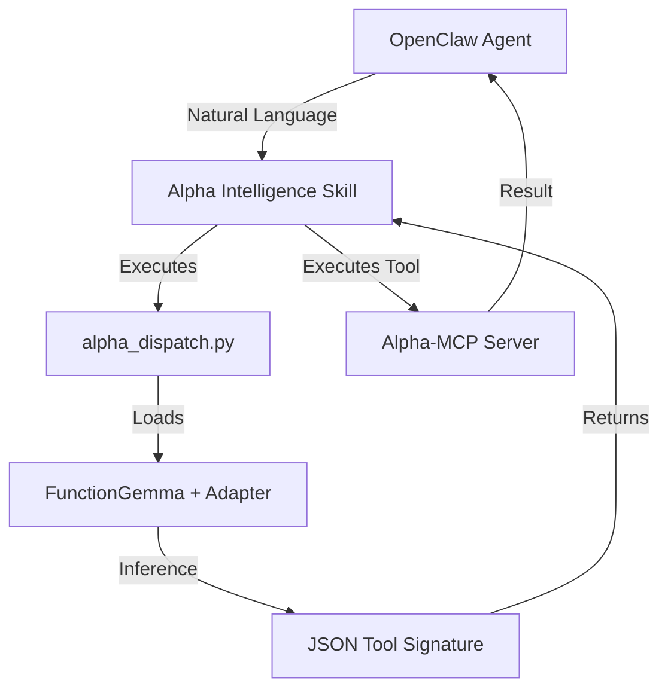

# 🔗 Integration Plan — Alpha-MCP × OpenClaw Skills

This document details the "Micro-Script + Skills" architecture for connecting your fine-tuned Gemma model to the OpenClaw agent fleet.

---

## 🏗 The "Alpha Dispatcher" Architecture

Instead of having every agent load the heavy model weights, we use a **Micro-Script Bridge**. This ensures low memory overhead and clean separation of concerns.



---

## 🔬 1. The Dispatcher Micro-Script

The script `scripts/alpha_dispatch.py` is the core bridge. It:
1.  **Bootstraps** the environment using your isolated `.venv`.
2.  **Loads** the fine-tuned adapter seamlessly using PEFT.
3.  **Parses** prompts into deterministic tool calls using `do_sample=False`.
4.  **Outputs** clean JSON to `stdout` for the skill to consume.

### Execution Command:
```bash
uv run scripts/alpha_dispatch.py "How is NVDA looking?"
```

---

## 🛠 2. The OpenClaw Skill Wrapper

Within the OpenClaw workspace, a new skill `alpha_intelligence` acts as a proxy.

### Skill Function: `resolve_alpha_intent(query)`
This function is a simple shell wrapper:

```python
import subprocess
import json

def resolve_alpha_intent(query):
    # Execute the micro-script inside the finetune package
    cmd = [
        "uv", "--project", "/home/mihir/projects/finetune_alpha_mcp",
        "run", "python3", "scripts/alpha_dispatch.py", query
    ]
    result = subprocess.run(cmd, capture_output=True, text=True)
    return json.loads(result.stdout)
```

---

## 🤖 3. Agent Integration (Musings / Finance)

Once the skill is registered, you can instruct your agents to use it in their `SOUL.md` or `IDENTITY.md`.

### Example Agent Logic:
> "Whenever you encounter a stock ticker or a specific market setup in your notes, use the `alpha_intelligence` skill to resolve the correct technical tool and fetch deep signal data. Do not guess signal values; always verify via Alpha-MCP."

---

## 📈 Expansion Workflow

When you add a new tool to `alpha-mcp/server.py`:
1.  **Register**: Add the tool schema to `tool_schemas.py`.
2.  **Synthetic Data**: Generate fresh examples (`scripts/generate_data.py`).
3.  **Retrain**: Run `python3 train.py --resume`.
4.  **Instant Update**: The `alpha_dispatch.py` script and the OpenClaw Skill **automatically** gain the new capability without any code changes to the skill itself.

---

## 🚀 Readiness Checklist
- [x] Comprehensive synthetic dataset (1,200 samples).
- [x] Checkpoint-aware training script.
- [x] Tool-call accuracy verification system.
- [x] **New**: High-speed dispatcher micro-script.
- [ ] **Pending**: Final fine-tuning run by USER.
- [ ] **Pending**: Skill registration in OpenClaw.

*Detailed documentation complete. 🦞🛡️📈*
